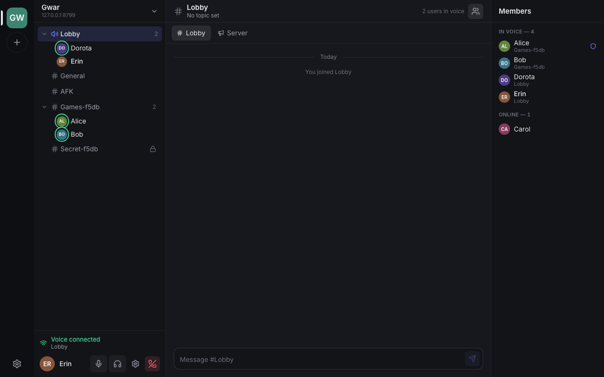

# Gwar

**Gwar** is an open-source, self-hosted voice chat. Run your own server,
talk from the browser or the desktop app, and keep your friends who still use
TeamSpeak in the same conversation.

**Use it:** the web app at <https://gwar.maciejwlodarski.com> connects to any
Gwar server (the project's own is `voice.maciejwlodarski.com`); so does the
desktop app.

*Gwar* is Polish for the buzz of many voices talking at once.



## Why

TeamSpeak works, but it moves slowly and its newer clients are hard to use.
Discord is polished, but it is a closed service you cannot host yourself.
Gwar aims for the middle: a server you own, a modern and simple interface, and
no lock-in, including compatibility with the TeamSpeak ecosystem people already
use.

## What it does today

- **Voice with very low latency.** Opus is forwarded by a WebRTC SFU without
  being decoded or re-encoded; the server only decides who hears whom.
- **Always on, like Discord.** You stay connected to a server without being in
  voice: read and write any channel's chat, see who is in which voice channel,
  join voice when you want to talk. Unread counts follow you across devices.
- **Channels and chat.** Nested channels, passwords, user limits, persistent
  channel history, private and server-wide messages, a member list with online
  and offline users.
- **Your identity is a key, not an account.** Every client holds an Ed25519
  key; it works on any Gwar server without signing up anywhere.
- **Optional Gwar Connect account** to be the same person on the web, the
  desktop and (later) the phone. Connect never sees your password or your
  key: it stores your identity encrypted, each device gets its own key
  certified by your identity, and a lost device is revoked without changing who
  you are. Servers verify devices themselves and keep working if Connect is
  down. See [docs/connect.md](docs/connect.md).
- **Moderation.** Roles with any permissions and colors, bans (timed or
  permanent, by identity or IP), invite links that can grant a role, server
  settings. Nobody can hand out more than they hold.
- **Chat like you expect.** Mentions with notifications, editing and deleting,
  images, video, audio and files (drag and drop or paste).
- **One web app, plus a desktop app, with one UI.** The project hosts the web
  app; it connects to any server. The Tauri 2 desktop app has a native audio
  engine (Opus with FEC, jitter buffer with loss concealment), global
  push-to-talk and a tray icon. English and Polish.
- **TeamSpeak in both directions.**
  - Official TeamSpeak 3 and 6 clients can join a Gwar server (optional, see
    below). They see the same channels and people, and talk and chat with
    everyone else.
  - The desktop app can connect to any existing TS3/TS6 server with the same
    interface.

Gwar is early software: it works and is tested end to end, but expect rough
edges and breaking changes.

## Download

Prebuilt apps are on the [GitHub Releases page](https://github.com/MaciejWlodarski/gwar/releases):

- **Desktop app:** macOS (universal `.dmg`), Windows (`.exe` or `.msi`) and
  Linux (`.AppImage` or `.deb`). Builds may be unsigned: macOS and Windows then
  warn at the first start, and [docs/releasing.md](docs/releasing.md) shows how
  to open them anyway.
- **Server:** `vc-server` and `gwar-connect` for Linux x86-64 and ARM64
  (`gwar-server-*.tar.gz`), so you do not need Rust to run your own. Unpack and
  continue with "Run a server" below, using `./vc-server` instead of
  `./target/release/vc-server`.

`SHA256SUMS` on each release lists the checksum of every file. Maintainers: see
[docs/releasing.md](docs/releasing.md) for how a release is made.

## Run a server

You run only the server; people connect with the official web app or the
desktop app. The web app is served over HTTPS, so browsers can only reach
servers that have HTTPS too, which the server can do on its own:

```bash
cargo build --release -p vc-server
./target/release/vc-server --data-dir data --domain voice.example.com --acme-email you@example.com
```

With `--domain` the server gets a certificate from Let's Encrypt and renews it
by itself (it answers the challenge on port 443, so nothing else is needed),
listens for HTTPS on 443 and redirects plain HTTP from port 80. Open
**TCP 443** (and 80 for the redirect) and **UDP 9987** for voice. Already have a
certificate or a reverse proxy? Use `--tls-cert`/`--tls-key`, or plain HTTP on
`--http` behind your proxy. `--public-ip` sets the address announced for voice
when the server is behind NAT; `vc-server --help` lists every option.

On first start the server prints a one-time **admin token**; open the web app,
connect to `voice.example.com` and redeem it from the server menu ("Use
token"). Get another one with `vc-server --data-dir data admin-token`.

The desktop app also connects to servers without HTTPS (e.g. on a LAN).

Servers accept Gwar Connect devices out of the box and fetch the list of
revoked devices from the official Connect service every five minutes
(`--connect-url` points elsewhere, `--no-connect` turns it off). Back up the
database while running with `vc-server --data-dir data backup copy.sqlite3`.

## Develop

Requirements: Rust (stable), Node 22+, pnpm, and libopus for the native clients
(`brew install opus` or `apt install libopus-dev libasound2-dev`).

```bash
pnpm install
cargo run -p vc-server -- --data-dir data        # server on http://localhost:8790
pnpm --filter web dev                            # web app on http://localhost:5173
pnpm --filter desktop dev                        # desktop app
```

`--web-root apps/web/dist` makes the server serve a built web app itself (handy
for development or a private network). Uploads from a web app on another
origin are allowed for the official web app and for `--web-origin` entries.

Microphone permission on the desktop app: macOS asks on first use (the bundled
app carries `NSMicrophoneUsageDescription` and the audio-input entitlement), and
Windows or macOS users who blocked it get an "Open privacy settings" button.
`tauri dev` runs an unbundled binary, so macOS attributes the prompt (and the
System Settings entry) to the terminal you started it from; test the real flow
with `pnpm --filter desktop build`. To reset a decision while testing:
`tccutil reset Microphone app.gwar.desktop`.

## TeamSpeak compatibility

Official TeamSpeak clients only accept servers that hold a license issued by
TeamSpeak, so Gwar does not imitate a TeamSpeak server. Instead, with
`--teamspeak --accept-teamspeak-license` it downloads the official TeamSpeak 3
server from TeamSpeak (checksum-verified), runs it as a hidden child process
and bridges it:

- channels, the server name and the welcome message are managed by Gwar and
  mirrored to TeamSpeak;
- TeamSpeak users appear in Gwar like everyone else, with a TS3/TS6 badge;
- a Gwar user who shares a channel with TeamSpeak users (or chats with one
  privately) gets a stand-in client on TeamSpeak, so TeamSpeak users see, hear
  and message them; everyone else is listed in the channel description. Voice
  crosses the bridge as Opus with about a millisecond of overhead.

TeamSpeak clients connect to `your-host:9987` (UDP); Gwar's WebRTC voice then
moves to 9988, so open both ports. On ARM64 hosts the x86-64 TeamSpeak server
runs under emulation (`apt install qemu-user libc6-amd64-cross
libstdc++6-amd64-cross`, or box64). Only one free-licensed TeamSpeak server may
run per machine.

**License note.** The TeamSpeak server is third-party software under its own
license, which you accept when enabling this option; Gwar does not ship it.
Its free license allows 32 slots (TeamSpeak users plus Gwar stand-ins) and is
for **non-commercial use only**; commercial operators need a license from
TeamSpeak. Gwar itself has no slot limits. Gwar is not affiliated with
TeamSpeak. TeamSpeak support is a cargo feature (`teamspeak`, on by default);
build without it with `--no-default-features`.

## Project layout

| Path | What it is |
| --- | --- |
| `crates/vc-server` | Server: core (state, permissions, SQLite), WebSocket gateway, WebRTC SFU, TeamSpeak bridge |
| `crates/vc-proto` | The `vc/1` protocol (Rust types, generated TypeScript types) |
| `crates/vc-client` | Native client: protocol, voice engine, TeamSpeak mode |
| `crates/gwar-connect` | Gwar Connect, the optional account service |
| `apps/web` | The shared UI (React): the hosted web app and the desktop app's UI |
| `apps/desktop` | Tauri 2 desktop app: native voice, global push-to-talk, tray |
| `scripts/deploy-vm.sh` | Deploys the server and Connect to a Linux host over SSH |

More in [docs/architecture.md](docs/architecture.md), [docs/connect.md](docs/connect.md)
and [docs/deploy.md](docs/deploy.md).

## Tests

```bash
cargo test --workspace          # includes end-to-end WebRTC voice tests
pnpm --filter web test          # UI unit tests
pnpm --filter web e2e           # Playwright: two browsers against a real server
VC_TS3_DIR=/tmp/ts3 cargo test -p vc-client --test teamspeak_mode --test teamspeak_interop -- --test-threads=1
                                # against the real TeamSpeak server (downloaded into VC_TS3_DIR)
```

## Roadmap

- **Mobile app** (iOS and Android).
- **Streaming**: screen sharing and video, peer to peer and through the server.
- **Better audio on desktop**: noise suppression and echo cancellation.
- **Fully native clients** later, keeping the same protocol.
- **Direct messages between Connect accounts**, end-to-end encrypted per
  device and relayed when the other side is offline.
- **More TeamSpeak options**: bring your own TeamSpeak license for more slots,
  and a mixed stand-in so Gwar users can still talk when the free slots run out.

Ideas and pull requests are welcome; open an issue to discuss bigger changes.

## License

MIT, see [LICENSE](LICENSE). Third-party components keep their own licenses,
see [THIRD_PARTY_NOTICES.md](THIRD_PARTY_NOTICES.md).
