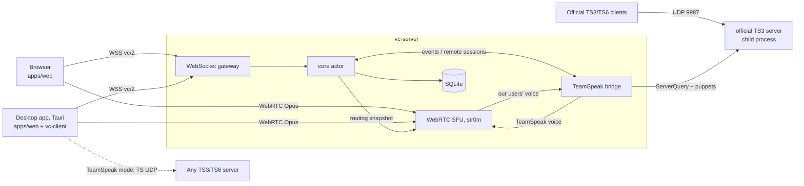

# Architecture

## Deployment model

People run **servers**; the project runs the **web app** (one origin, today
`https://gwar.maciejwlodarski.com`, see `OFFICIAL_WEB_ORIGIN`), which connects
to any server over `wss://`. Hence servers need HTTPS: `--domain` gets and
renews a Let's Encrypt certificate inside the server (`src/tls.rs`), and
uploads accept cross-origin requests from the web app's origin only (CORS on
the file routes; uploads are authorized by one-time tokens, not cookies). The
desktop app connects anywhere, including plain `ws://` on a LAN.

## Principles

- **One owner of state.** `core` is an actor (a single tokio task): every
  change to channels, users and permissions goes through it in order, so every
  client sees the same sequence of events, without locks. Transports
  (WebSocket, TeamSpeak) are thin: they translate to `vc/2` and back.
- **Audio is never decoded on the server.** Opus frames are forwarded as they
  are (SFU). The server only decides *who hears whom*, from a routing snapshot
  the core publishes (`ArcSwap`, lock-free reads). Clients decode and mix
  themselves (TS3 does it natively; browsers and the desktop app have 8 fixed
  receive "slots" assigned to active speakers).
- **Speech gate on the server.** Browsers send their audio level (RFC 6464);
  the server drops silence, drives the "talking" indicator and ends talk spurts
  for TeamSpeak clients.

## The `vc/2` protocol

JSON over a WebSocket (`/ws`). The full, commented definition is
[`crates/vc-proto/src/lib.rs`](../crates/vc-proto/src/lib.rs); the TypeScript
types are generated with `cargo test -p vc-proto --features ts`.

1. Server: `challenge {nonce}`. Client: `hello` with its Ed25519 public key and
   a signature of `"vc/1 hello\n" + nonce + "\n" + public_key`. Reply:
   `Welcome` (server state, channels, clients, members, unread counts,
   permissions, ICE servers).
2. Requests `{"id", "op", "d"}` → `{"re", "ok" | "err"}`; events `{"ev", "d"}`.
3. Voice: `voice.offer` (SDP with one sender and 8 receivers) → SDP answer;
   `voice.slot` says whose voice flows through which slot.

## Presence (like Discord)

Being connected is not being in voice. After connecting, `Client.channel` is
`null`: you see everyone and read and write channel chats, but you don't
transmit. `channel.join` enters a channel's voice, `channel.leave` leaves it
(the session stays). A password channel's chat opens once you have entered it
during the session (or with the `channel_join_locked` permission).

Read marks are stored per user in SQLite (`read_marks`), so unread counts
(`Welcome.unread`, `chat.read`) agree on every device; `Welcome.members` lists
known users, offline ones included.

A nickname belongs to a member on this server. `hello.nickname` initializes it
only on the first join; every later session uses the stored name. `client.update`
changes mute, deafen and away state. `member.nickname {uid, nickname}` changes the
trimmed 1–32 character name (no control characters): one's own freely, another's
with `member_nickname`. Duplicates are allowed. The empty-ok reply follows
`member.updated` and `client.updated` for every online session. Errors are
`bad_request` for invalid names, `forbidden` for missing permission, `not_found`
for an unknown member, and `internal` for storage failures.

`Member.tag` is the shortest distinguishing lowercase RFC 4648 base32 prefix
(minimum 10 characters) across **all** members, even those omitted from Welcome.
UIDs decode from base64url; `ts:` UIDs decode from standard base64. Malformed UIDs
fall back to the first 20 bytes of SHA-256 of the UID string. Sorted neighbours
determine the prefix lengths; joins and removals announce affected tags through
`member.updated`. Tags may grow or shrink. `Member.connect` is a public handle
confirmed asynchronously by Connect (see [connect.md](connect.md)).

Stored chat author names remain send-time snapshots. History and message reads
use the member's current name while their record exists, then fall back to the
snapshot after removal.

## Identity and permissions

A user is their Ed25519 key (like a TeamSpeak identity): no central accounts,
and it works on any self-hosted server. Groups (Admin, Member) carry permission
lists; one-time tokens grant groups. Channel and server passwords are stored as
Argon2 of TeamSpeak's wire form `base64(sha1(password))`.

Members are the users' rows in SQLite (`users`, with groups and read marks).
`member.remove` deletes one (and with `delete_messages` their stored messages
and files, announcing `chat.deleted` for each); it follows the same rule as bans
and group changes: nobody acts on a member holding permissions they lack.
`member.prune` does it for everyone unseen for N days (`users.last_seen`, set on
connect and disconnect and refreshed for connected users every ten minutes and at
shutdown). The core is a single actor, so one call removes at most 50 members
and the client repeats it. Private and server-wide messages are never stored,
so there is nothing of them to delete. `vc-server members` does the same on the
database directly and needs the server stopped (`data/vc.lock`). `members merge
<from-uid> <into-uid> [--dry-run]` requires two existing members and the exclusive
lock, even in dry-run mode. It reassigns messages, uploads, mentions and UID bans,
unions roles, keeps the highest read mark per channel, and deletes the source in
one transaction. The target keeps its name, key and Connect cache. Ban/invite
creator names are snapshots; device revocations remain bound to account keys.

## TeamSpeak

Puppets follow the stored member nickname. If TeamSpeak refuses a collision,
creation and renaming retry with ` (2)`, ` (3)`, and so on, truncating the base
so the whole name fits TeamSpeak's 30-character limit. A member's sessions may
therefore have different TS suffixes while retaining the same Gwar nickname.

- **Official TS3/TS6 clients on our server.** They only accept servers holding
  a TeamSpeak-issued license, so `src/teamspeak/` (cargo feature `teamspeak`)
  installs and supervises the official TeamSpeak 3 server and bridges it:
  - channels and server settings are mirrored one way through ServerQuery
    (`bridge.rs`, `channels.rs`); our core is the authority;
  - TeamSpeak users are *remote sessions* in the core (`core/bridge.rs`):
    visible to everyone, with their state dictated by the TeamSpeak server;
  - one of our users sharing a channel with TeamSpeak users (or chatting with
    one privately) gets a *puppet* on TeamSpeak (`puppet.rs`, tsclientlib).
    Slots are scarce, so everyone else is only listed in the channel
    description (`Presence` in `bridge.rs`, which leaves room for a mixed
    stand-in when the server is full). A user's gated voice goes from the SFU
    straight into their puppet; what puppets hear from TeamSpeak users is
    published to the SFU as the remote session's voice (the first copy of a
    frame wins). No buffering, no transcoding.
  - channel chat from TeamSpeak uses a dedicated ServerQuery listener in
    every bridged channel occupied by a remote TeamSpeak user (`listeners.rs`).
    Each logs in as `serveradmin`, selects virtual server 1, moves into its
    channel and subscribes to `textchannel`. The pool follows remote joins,
    moves and leaves, releases empty channels, and retries failed connections
    every five seconds with a warning. It is capped at 128 occupied channels
    (overflow warns); query clients use no voice slots. Messages retain their
    decoded text and are attributed to the remote user's Gwar session in the
    listener's mapped channel. Puppets relay only private messages and pokes,
    so channel text has exactly one source, including repeated identical text.
    Our own puppets and query clients are excluded from remote sessions to
    prevent echoes. Server chat uses the main query's `textserver` subscription;
    Gwar channel chat uses a puppet or the separate, movable posting query.
- **Our client on TeamSpeak servers.** `vc-client::teamspeak` (tsclientlib)
  presents a TeamSpeak server as `vc/2` (Welcome + events), so the UI has no
  TeamSpeak-specific code; voice goes straight to the native engine.

## Clients

- `apps/web`: React. The connection (`net/connection.ts`) and the voice engine
  (`voice/engine.ts`) sit behind interfaces.
- `apps/desktop`: Tauri 2 with the same UI; voice through the native
  `vc-client` (cpal, Opus with FEC, jitter buffer with PLC), global
  push-to-talk, tray.
